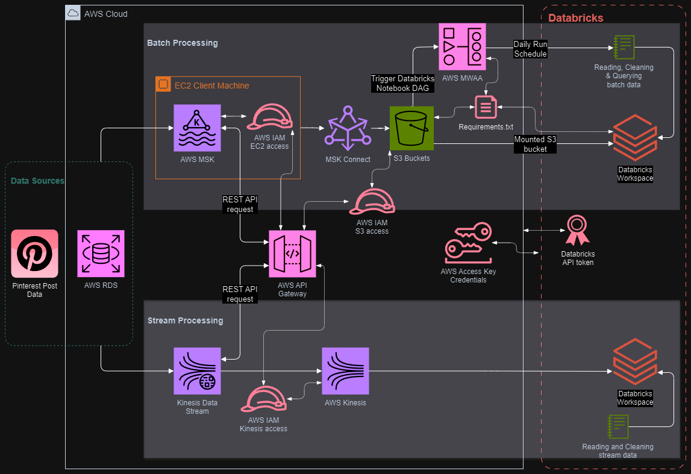
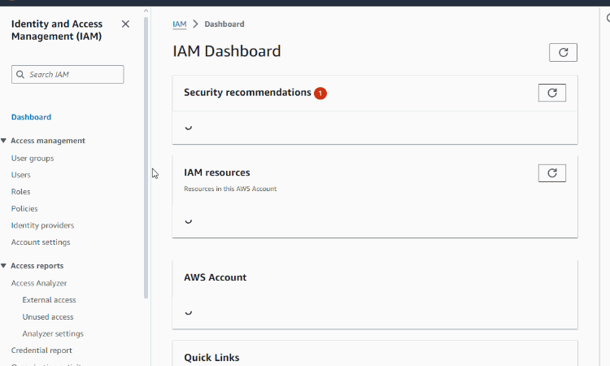
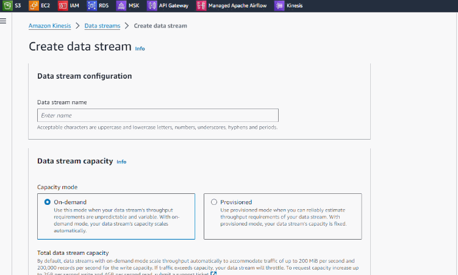
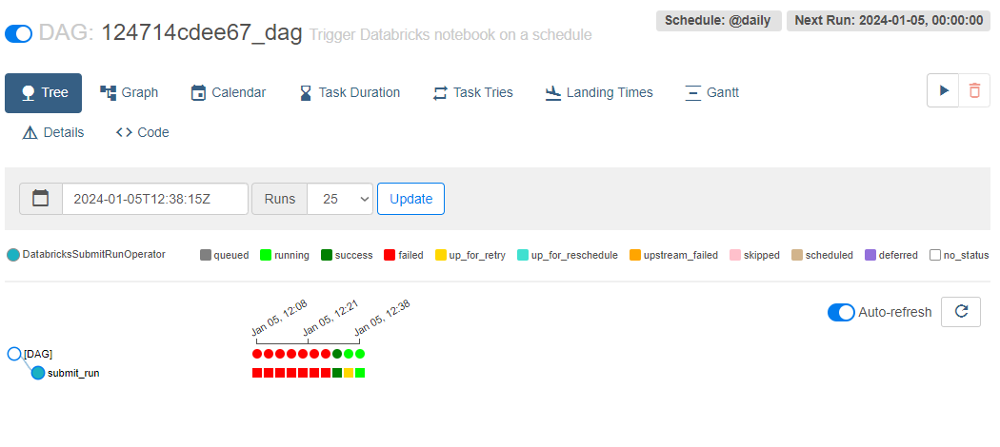

# Pinterest Data Pipeline

## Table of contents

- [Pinterest Data Pipeline](#pinterest-data-pipeline)
  - [Table of contents](#table-of-contents)
    - [Description](#description)
    - [Aim](#aim)
      - [Configuration Troubleshooting](#configuration-troubleshooting)
  - [Prerequisites 🔧](#prerequisites-)
    - [AWS Configuration Example ⚙️](#aws-configuration-example-️)
    - [Example Use 📎](#example-use-)
  - [Technologies used in this project](#technologies-used-in-this-project)
  - [File Structure 📂](#file-structure-)
  
---

### Description

AWS-hosted end-to-end data pipeline inspired by Pinterest's experiment processing pipeline.
Pinterest crunches billions of data points every day to decide how to provide more value to their users. In this project, you'll create a similar system using the AWS Cloud.

The pipeline is developed using a Lambda architecture. The batch data is ingested using AWS API Gateway and AWS MSK and then stored in an AWS S3 bucket. The batch data is then read from the S3 bucket into Databricks where it is processed using Apache Spark.

The streaming data is read near real-time from AWS Kinesis using Spark Structured Streaming in Databricks and stored in Databricks Delta Tables for long term storage.


> End-to-end data pipeline AWS cloud architecture, integrated with Databricks and displaying IAM and permission access points.

### Aim

Build an end-to-end data pipeline using AWS-hosted cloud technologies, integrated with Databricks for processing and long-term storage.

The pipeline facilitates social media analytics, of stream data in real-time and of data at rest for sentimental analysis, trending categories and user engagement.

<details>
<summary><h3>Achievement Outcomes📖</h3></summary>


- Configuring AWS EC2 instances
- Installation and configuration of Kafka on EC2 client machine
- Creating topics with Kafka on EC2 instance

---


- Configuring S3 bucket and MSK Connect
- Confluent to connect to S3 bucket and Kafka topics
- Creation of customised plugins and configuring MSK connector with IAM roles
  
---


- Creating resource for proxy integration for REST API gateway
- Deployment of API
- Creation of API stages for deployment
- Configuration of Kafka REST proxy API on EC2 client machine
- Installation of Confluent package
- Configuration of kafka-rest.properties to perform IAM authentication
- Starting REST proxy on EC2 client machine
- Sending streaming data using API invoke URL to S3 bucket
  - Formatting data to JSON message formatting for API processing
  - Data from 3 pinterest tables to corresponding Kafka topics
- Creating and configuring resources
- Creating and configuring GET, POST, DELETE and PUT methods with integration requests.

---


- Creating Databricks workspace
- Creating access key and secret access key for in AWS for full S3 access
- Loading in credential file to Databricks
- Mounting S3 bucket in Databricks
- Reading in .json format data into Databricks dataframes
- Reading and writing streaming data from Kinesis Data Streams
  


- Cleaning data using PySparks
- Dataframe joins
- Querying and aggregations of data
  - group by
  - classifying values into groups
  - alias
  - sorting data


- Creating DAG to trigger Databricks notebook to run on schedule
- Uploading DAG to S3 bucket
- Using AWS MWAA environment to access Airflow UI
- Triggering DAG successfully
- Ensuring Databricks notebook is compatible with DAG and Airflow workflow


- Creating data streams in AWS Kinesis console
- Configuring REST API with Kinesis proxy integration
  - List streams
  - Create, describe and delete streams
  - Add records to streams
- Sending data to Kinesis Data Streams with REST APIs
  
---

#### Configuration Troubleshooting

- Troubleshooting through all configurations and set up of AWS services and users on AWS CLI
  - Including checking through all IAM permissions, MSK connect plugin and connector configuration, EC2 instances connection issues, API gateway configurations.
- Troubleshooting connection issues in Databricks, credentials configuration and Delta data formatting issues.
  
</details>

## Prerequisites 🔧

- `AWS account` with appropriate permissions for EC2, S3, AWS MSK, MSK connect, AWS API gateway, AWS MWAA, AWS Kinesis
- `AWS CLI` installation and configured with AWS account credentials
- `Databricks` account - with AWS credentials and API tokens

> Best configured with `Linux`, `MAC` or on windows with `WSL`

### AWS Configuration Example ⚙️

`Batch Processing:`


> EC2 Key-Pair information for "-key-pair.pem" ⤵️


> EC2 SSH Connection instructions and command ⤵️


> Edit IAM trust policy for EC2 access-role ⤵️



---

`Stream Processing:`


> Creating Kinesis Data Streams in AWS ⤵️




> API Kinesis proxy integration, resources and method configuration ⤵️


---

### Example Use 📎

`Batch Processing:`

1. Initiate configured AWS EC2 Client machine and start Kafka REST API

     [example\-key\-pair.pem](example-key-pair.pem) located in project directory

      ```bash
      # Make sure access to key-pair.pem is not public
      chmod 400 <aws_iam_user_name>-key-pair.pem

      # Connect to EC2 client machine
      ssh -i "<aws_iam_user_name>-key-pair.pem" ec2-user@ec2-3-81-220-171.compute-1.amazonaws.com

     # Navigate to 'confluent/bin' directory
      cd confluent-7.2.0/bin
     # Start Kafka REST API
      ./kafka-rest-start /home/ec2-user/confluent-7.2.0/etc/kafka-rest/kafka-rest.properties
      ```

2. Run python script to ingest data to S3 bucket with REST API requests

     ```py
     user_posting_emulation.py
     ```

3. `Airflow` DAG to trigger Databricks Notebook on a specified schedule in AWS MWAA Airflow UI

    ```py
    # Airflow DAG script, loaded into S3 bucket and connected to AWS MWAA environment
    124714cdee67_dag.py
    ```

    > 

4. Mount S3 bucket to configured Databricks workspace and read in batch data for processing with Databricks Notebook

   ```shell
   # Databricks Notebook
   Reading, cleaning and querying Pinterest Data from mounted S3 bucket using Sparks.ipynb
   ```

---

`Stream Processing:`

1. Run python script to stream data to Kinesis Data streams with configured REST API

    ```py
    user_posting_emulation_streaming.py
    ```

2. Read in streaming data to Databricks with Databricks Notebook, and clean and write stream data to delta tables.

   ```shell
   # Databricks Notebook
    Reading and cleaning data from Kinesis Data Stream.ipynb
   ```

## Technologies used in this project

 - AWS Account and AWS services

 - EC2 instance and client machine

 - Kafka and Confluent to connect with S3 buckets and topic creation and consuming data

 - MSK cluster creation and connection from API to S3 buckets

 - IAM access roles

 - S3 simple storage for objects

 - Creating REST APIs with proxy integrations, child resources and methods.

 - Orchestrating workflows on a schedule with DAGs

 - Mounting AWS S3 buckets for reading in batch data, reading and writing streaming data, data processing and long term storage in Delta tables

 - Spark structured streaming and data processing in Databricks

 - Creating Kinesis Data Streams and streaming data through REST APIs

## File Structure 📂

- 📂 __pinterest\-data\-pipeline819__
  - 📄 [124714cdee67\_dag.py](124714cdee67_dag.py)
  - 📄 [README.md](README.md)
  - 📄 [Reading and cleaning data from Kinesis Data Stream.ipynb](Reading%20and%20cleaning%20data%20from%20Kinesis%20Data%20Stream.ipynb)
  - 📄 [Reading, cleaning and querying Pinterest Data from mounted S3 bucketusing Sparks.ipynb](Reading%2C%20cleaning%20and%20querying%20Pinterest%20Data%20from%20mounted%203%20bucket%20using%20Sparks.ipynb)
  - 📄 [example\-key\-pair.pem](example-key-pair.pem)
  - 📂 __gif__
    - 📄 [1.EC2\_key\_pair\_small.gif](gif/1.EC2_key_pair_small.gif)
    - 📄 [1.Kinesis\_Data\_Stream\_creation\_small.gif](gif/1.Kinesis_Data_Stream_creation_small.gif)
    - 📄 [2.API\_resource\_methods\_kinesis\_streams\_small.gif](gif/2.API_resource_methods_kinesis_streams_small.gif)
    - 📄 [2.EC2\_ssh\_connect\_small.gif](gif/2.EC2_ssh_connect_small.gif)
    - 📄 [3.IAM\_role\_trust\_policy\_ec2\_access\_small.gif](gif/3.IAM_role_trust_policy_ec2_access_small.gif)
  - 📂 __img__
    - 📄 [Airflow\_dag.png](img/Airflow_dag.png)
    - 📄 [Pinterest\_architecture.detailed.png](img/Pinterest_architecture.detailed.png)
  - 📄 [user\_posting\_emulation.py](user_posting_emulation.py)
  - 📄 [user\_posting\_emulation\_streaming.py](user_posting_emulation_streamingpy)